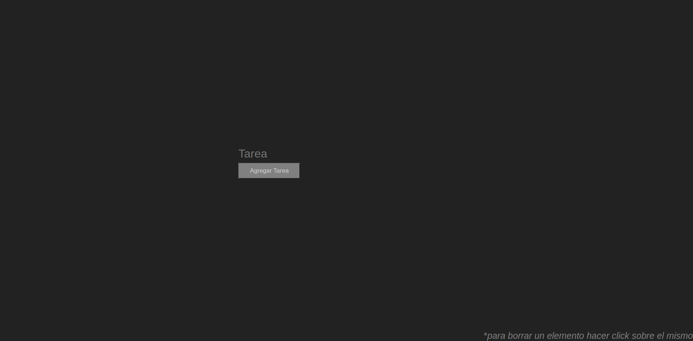

	

---

# toDoList

---

*****toDoList** es una app que permite listar cosas por hacer o a recordar en una sencilla lista,  una vez terminada la tarea se puede quitar de la lista con solo hacer click sobre ella.
	 

